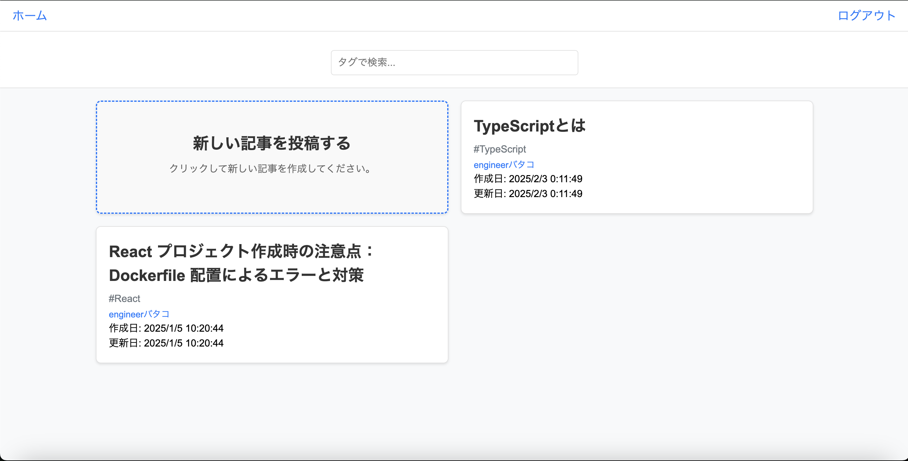
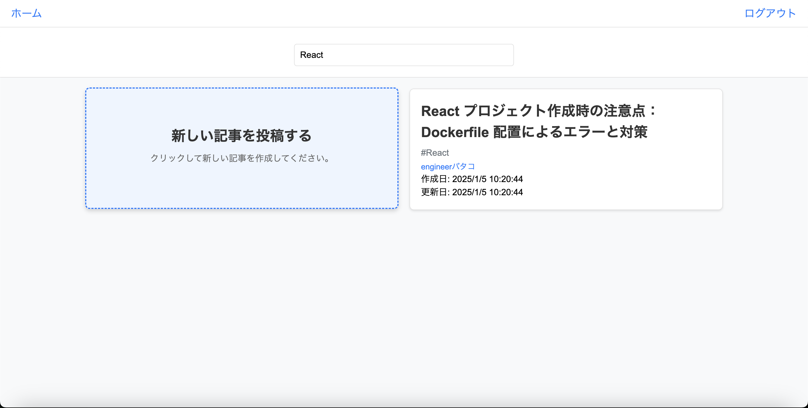
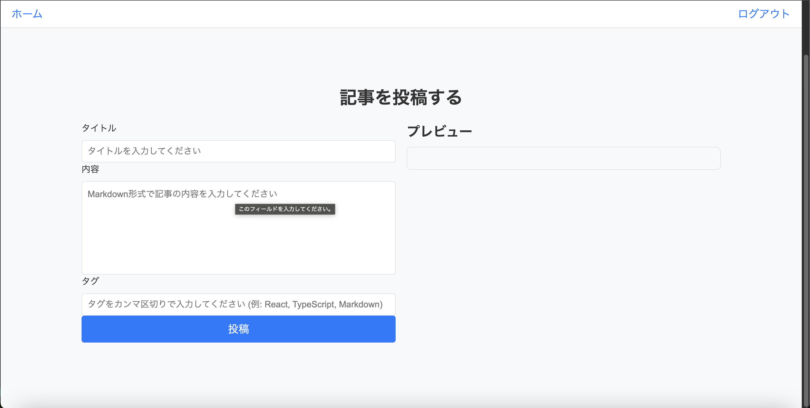
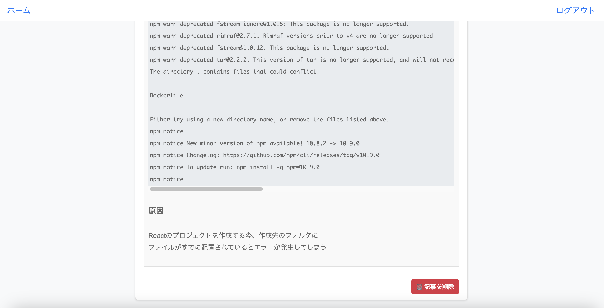

### 　技術ブログ

学んだ技術を Markdown 形式の記事で記録できるようにするアプリケーションです。Excel ではなく、Markdown で記録できるようにしているため、Excel がつかない Mac ユーザーやスマホからでも
記事でも投稿および、確認ができるようになっています。

### 使用技術

-   Typescript
-   React v18
-   Firebase
-   Docker

### 機能一覧(実装済)

-   ログイン(ログイン)
-   記事一覧
-   記事投稿
-   記事詳細
-   タグ検索機能

### 実装予定の機能

-   コメント機能
-   いいね機能

## 画面一覧

-   画面は PC サイズで表示

-   ログイン画面

## 

-   記事一覧

## 

-   タグ検索機能

## 

-   記事作成

## 

-   記事詳細

## 

## 
